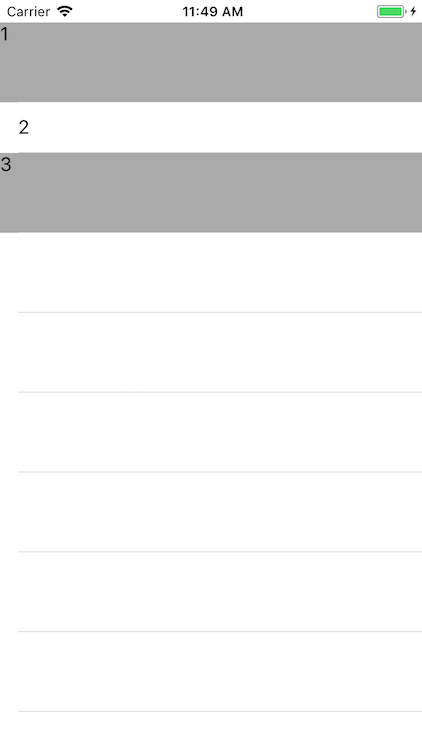

# Why the default constaints of UITableViewCell labels should not be overridden

In this small example the constraints of the `-[UITableViewCell textLabel]` is overridden and checking the behaviour of the cell.

Here's the visual representation of the coded cells; the gray ones are the custom cells and the white remained untouched.

This shows the override was successful. 

However, if the cell is re-rendered -scrolled out of the screen for example or the state is changed- the custom constraints are ignored.

Using self-provided `UILabel` instance solves the issue.

Conclusion: if you want to have predictable layout of the cells, create your own `UIView` hierarchy.
